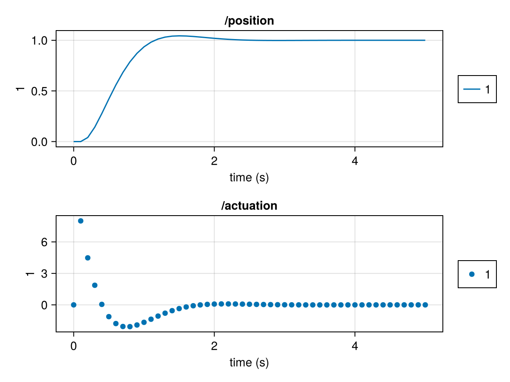

# SystemsOfSystems.jl

SystemsOfSystems is a simulation engine for models that contain models that contain models, etc., where each model can have both continuous and discrete dynamics, outputs, and random variables. Given a top-level model and its dynamics, SystemsOfSystems will simulate it (and its sub-models) over time, producing a time history of states and outputs for all models. Further, the simulation engine allows different solvers, methods for logging and sub-sampling the data, and "hooks" into the simulation loop for integrating processes outside of the models, like showing a live animation or progress bar.

See [the documentation](https://www.gradient.team/SystemsOfSystems.jl/) for details.

Here is a very quick simulation that shows a single model with both continuous and discrete states. It's a typical control system example with a second-order "position and velocity" system. The controller will trigger every 0.1s, and its output will be held constant until the next trigger time. The position and velocity will be updated continuously using an adaptive-step solver.

```julia
using SystemsOfSystems

constants = (;
    mass = 1.,
    kp = 8., # Proportional gain for the controller
    kd = 4., # Derivative gain for the controller
)

history = simulate(
    constants; # Any arbitrary thing we want to pass to init_fcn
    t = (0, 5), # Any collection of times from start to end
    init_fcn = (t, constants, seed) -> ModelDescription(;
        constants = constants, # We'll keep our mass and gains as constants.
        continuous_states = (; # We'll add fields for position and velocity.
            position = 0.,
            velocity = 0.,
        ),
        discrete_states = (; # We'll add a field for the actuation force.
            actuation = 0.,
        ),
        schedules = (;
            control_schedule = RegularSchedule(0.1), # Triggers at 10Hz
        ),
    ),
    rates_fcn = (t, model) -> RatesOutput(;
        rates = (; # The derivative of each continuous state
            position = model.velocity,
            velocity = model.actuation / model.mass
        ),
    ),
    updates_fcn = (t, model) -> on_triggering(model.control_schedule, t) do
        UpdatesOutput(;
            updates = (; # How each discrete state updates this sample
                actuation = model.kp * (1 - model.position) - model.kd * model.velocity,
            ),
        )
    end,
)
```

This gives:

```
Simulation History:
  Stop Reason: The sim reached the specified end time of 5.0.
  Model Histories:
    /
```

Let's look at the time histories available in that root model ("/"):

```julia
julia> history["/"]
ModelHistory for / with the following contents:
  type: Nothing
  constants:
    mass => Float64
    kp => Float64
    kd => Float64
  continuous_states:
    position => TimeSeries{Vector{Float64}, Vector{Float64}, LinearInterpolation}
    velocity => TimeSeries{Vector{Float64}, Vector{Float64}, LinearInterpolation}
  discrete_states:
    actuation => TimeSeries{Vector{Float64}, Vector{Float64}, SampleAndHold}
```

And now let's plot it:

```julia
julia> using CairoMakie # Any Makie-based plotting package will do.

julia> plot_ts(
           [
               history["/"]["position"],
               history["/"]["actuation"],
           ]
       )
```



At this point, we could update our simulation to decorate those variables with titles, labels, units, etc., all of which would show up on the plots. More critically, we can begin adding sub-models, random variables, logging options, hooks for other processes, and resources for loading from and writing to external processes from a model.

See [the documentation](https://www.gradient.team/SystemsOfSystems.jl/) for the next step.
